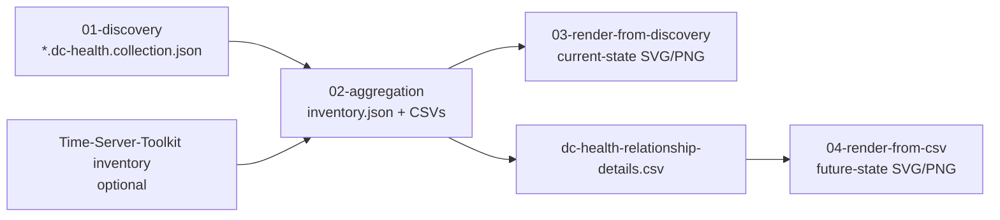

# High-Level Design

## Workflow

## Components

| Component | Responsibility |
| --- | --- |
| `Export-ADDomainControllerHealthCollection.ps1` | Read-only live collection. |
| `Merge-ADDomainControllerHealthCollections.ps1` | Offline normalization, readiness flags, finding generation, and CSV export. |
| `Convert-ADDomainControllerHealthInventoryToSvg.py` | Shared inventory/CSV SVG renderer. |
| Render wrappers | Resolve Python/browser paths and optionally convert SVG to PNG. |

## Readiness Model

The merger emits three planning-oriented readiness flags:

- `RoleTransferReadinessStatus`
- `DecommissionReadinessStatus`
- `MigrationReadinessStatus`

These are conservative summaries of generated evidence. Critical evidence becomes `Blocked`; warning evidence becomes `Review`.

## Time Integration

The merger reads Time-Server-Toolkit `inventory.json` if available and maps time rows to DC hostnames. It copies source, source type, service status, and collection status into DC health outputs. It does not run `w32tm`.
