# DNS Diagram Toolkit High-Level Design

This document records the architecture and intent behind the DNS Diagram Toolkit. The committed requirements remain in `requirements.md`.

## Purpose

Collect Windows DNS Server configuration, optionally merge AD Sites and Services context produced by the separate AD toolkit, and render DNS topology diagrams and review tables for current-state documentation and future-state planning.

## Architecture

```mermaid
flowchart LR
    subgraph Discovery["01-discovery"]
        Dns["Export-DnsMapCollection.ps1"]
    end

    ExternalSites["../AD-Sites-Services-Topology-Toolkit Export-ADSitesAndServicesInventory.ps1"]
    Dns --> Collections["input/discovery-collections/*.collection.json"]
    ExternalSites -. optional sites collection .-> Collections

    Collections --> Merge["02-aggregation/Merge-DnsMapCollections.ps1"]
    Merge --> Inventory["output/01-merged-inventory/inventory.json + CSVs + current-state.mmd"]

    Inventory --> RenderInventory["03-render-from-discovery/New-DnsMapImagesFromInventory.ps1"]
    RenderInventory --> Current["output/02-current-state-images"]

    Current --> FutureCsv["04-render-from-csv/New-DnsMapFutureStateCsv.ps1"]
    FutureCsv --> ManualCsv["input/manual-csv/future-state.dns-relationship-details.csv"]
    ManualCsv --> RenderCsv["04-render-from-csv/New-DnsMapImagesFromCsv.ps1"]
    RenderCsv --> Future["output/03-csv-generated-images"]
```

## Data Sources

- Windows DNS Server via the `DnsServer` PowerShell module, one collection file per queried DNS server.
- Optional AD Sites and Services collection files produced by `../AD-Sites-Services-Topology-Toolkit`.

DNS owns only DNS collection. AD site/subnet topology is collected by the sibling AD toolkit and can be copied into the DNS input folder when DNS diagrams need location enrichment.

## Core Artifacts

| Artifact | Role |
| --- | --- |
| `inventory.json` | Normalized source of truth for renderer inputs. |
| `dns-relationship-details.csv` | Editable edge list that maps diagram labels to review rows. |
| `dns-zones.csv` | Flat zone review table. |
| `dns-forwarders.csv` | Flat standard forwarder review table. |
| `dns-conditional-forwarders.csv` | Flat conditional forwarder review table. |
| `dns-record-summary.csv` | Record-count and optional sample review table. |
| `current-state.mmd` | Lightweight Mermaid current-state topology. |
| `*-combined.svg/png` | Whole-topology diagram. |
| `*-source.svg/png` | Per-DNS-server lane diagram. |

## View Types

### Combined

The combined view is the whole topology at a glance. It groups DNS servers by AD site when optional site data exists and shows hosted zones, forwarders, conditional forwarders, delegations, authoritative name servers, root hints, and external DNS dependencies.

### Source

The source view is one lane per DNS server. It shows what each server hosts or forwards, plus site/subnet context and DNS attributes such as recursion, dynamic updates, aging/scavenging, and replication scope where available.

## Current-State And Future-State

Current-state diagrams are discovery-driven. Future-state diagrams are CSV-driven: the current-state relationship CSV is copied into `input/manual-csv`, edited, and re-rendered without querying live infrastructure.

CSV-driven rendering must reconstruct a minimal inventory from the relationship CSV alone. Inventory-only attributes that are not present in the CSV should render blank, not fail the diagram.

## Scope Boundaries

This toolkit does not:

- Simulate client resolver behavior from DHCP or endpoint configuration.
- Audit DNSSEC, DNS Policies, or DNS security posture.
- Render individual host records as diagram nodes or edges.
- Prove query behavior at runtime.

The toolkit documents discovered DNS configuration and planned relationships; it does not test resolution behavior.
